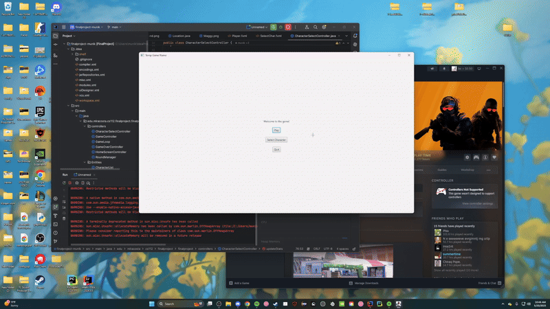
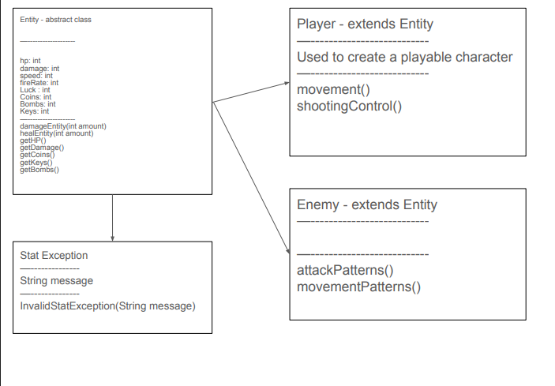
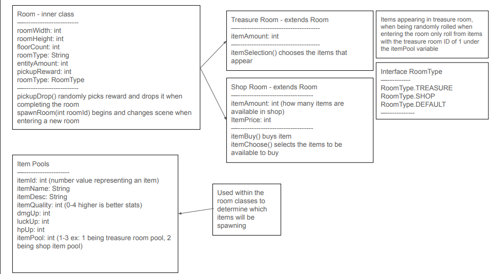
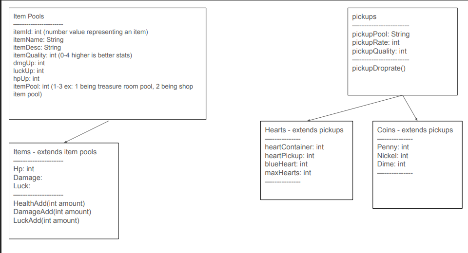
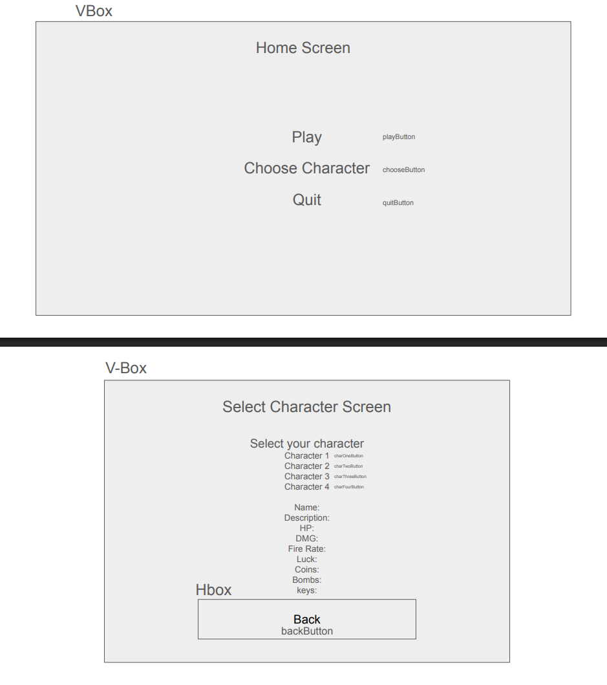
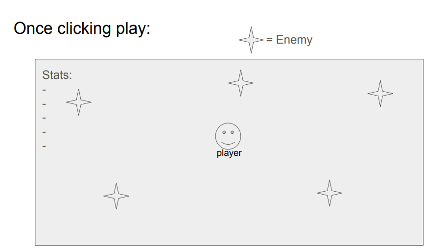

CAVE FIGHTER

In this program, the user will be playing a wave based game
where enemies will spawn with increasing amounts and health.
The goal is to make it all the way to the end of 40 rounds without taking too much damage
Our inspiration for this game comes from the game Binding of Isaac
https://store.steampowered.com/app/250900/The_Binding_of_Isaac_Rebirth/

UMLs:

https://i.imgur.com/YKCZ55s.png 

Wireframe: 

